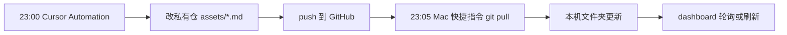

# Fund Lab · 基金实验室

面向基金小白的 **AI 投资学习陪练**，附带一个 **本地 HTML 看板**。

帮你把持仓、收益、纪律、复盘整理成自己电脑上的 Markdown 档案，用 AI 做透视、周报、快照更新；看板负责把这一切可视化。**不连接任何基金账户 API**。

> **免责声明**：仅供学习与研究框架，不构成投资建议，最终决策权在你自己。

---

## 你能用它做什么

| 能力 | 说明 |
|------|------|
| 持仓透视 | 看清组合结构、缺口与风险集中度 |
| 亏损体检 | 分析「基金赚了但我亏了」的原因 |
| 市场周报 | 每周环境简报，对照自己的组合 |
| 每日快照 | 记录当日收益，驱动看板日历/曲线 |
| 投资纪律 | 止盈止损、加仓规则，写下来并跟踪 |
| 复盘日记 | 记录心态与决策，支持心情标签 |
| 基金词典 | 小白术语 + 你的个性化笔记 |
| 本地看板 | 收益日历、KPI、知识中枢，一键浏览 |

---

## 安装

需要已安装 [Node.js](https://nodejs.org/)（用于运行 `npx`）。

Fund Lab 通过 [Skills CLI](https://github.com/vercel-labs/skills) 分发，**你的 AI agent** 及 Claude Code、Codex、Gemini CLI 等 70+ 工具都能识别。也可在 [skills.sh](https://skills.sh) 搜索 `fund-lab`。

### 选项 1：一行安装（推荐）

在终端运行：

```bash
npx skills@latest add rebecha1227-a11y/fund-lab
```

运行后会：

1. 从 GitHub 拉取最新 skill（含 `dashboard.html` 看板）
2. **自动检测**你电脑上已安装的 AI 工具
3. 让你选择安装到 **当前项目** 还是 **全局**

安装完成后，**重新打开或重载**你的 AI agent（例如重启应用、新开一个对话窗口）。

刷新到最新版：

```bash
npx skills update
```

---

### 选项 2：指定 AI 工具安装

如果自动检测没认出你的工具，可以手动指定 Agent（`-a` 是 `--agent` 的简写）：

| 工具 | 命令 |
|------|------|
| **你的 AI agent** | `npx skills add rebecha1227-a11y/fund-lab -a cursor` |
| **Claude Code** | `npx skills add rebecha1227-a11y/fund-lab -a claude-code` |
| **Codex** | `npx skills add rebecha1227-a11y/fund-lab -a codex` |
| **Gemini CLI** | `npx skills add rebecha1227-a11y/fund-lab -a gemini-cli` |

一次装给多个工具：

```bash
npx skills add rebecha1227-a11y/fund-lab -a cursor -a claude-code
```

**装到全局**（所有项目都能用，推荐基金档案单独放一个文件夹时）：

```bash
npx skills add rebecha1227-a11y/fund-lab -g
```

---

### 选项 3：无交互安装（脚本 / 高级用户）

想跳过所有确认提示时再加 `-y`：

```bash
npx skills add rebecha1227-a11y/fund-lab -g -y
```

---

### 选项 4：Git 克隆（可选）

只想用 git 备份自己的工作区，可以克隆仓库，但 **仍建议执行选项 1** 让 AI 工具能自动识别 skill：

```bash
git clone https://github.com/rebecha1227-a11y/fund-lab.git
cd fund-lab
npx skills@latest add rebecha1227-a11y/fund-lab
```

---

### 装好后文件在哪

| 安装范围 | 典型路径 |
|----------|----------|
| 全局（你的 AI agent） | `~/.cursor/skills/fund-lab/` |
| 当前项目 | `.agents/skills/fund-lab/` 或 `.cursor/skills/fund-lab/` |

GitHub 仓库内 skill 正本在 **`skills/fund-lab/`**（供 `npx skills add` 发现与安装）。

skill 包里包含：`SKILL.md`、`references/`、`templates/`、**`dashboard.html`（本地看板）**。  
你的私人持仓数据**不在这里**，而在你自己工作区的 `assets/` 文件夹（见下文「快速开始」）。

---

## 快速开始

### 第 1 步：准备你的工作区文件夹

在电脑上新建或选一个文件夹，例如 `我的基金档案`，在你的 AI agent 里**打开这个文件夹**作为工作区。

你的私人数据都会放在这里的 `assets/` 目录，**不会上传到 GitHub**。

### 第 2 步：初始化

在你的 AI agent 聊天框输入：

```
/fund-lab 初始化
```

AI 会引导你说明：在哪些平台买基、持有哪些基金、收益从哪个 App 看，并帮你在 `assets/` 里建好档案。

> 也可以手动从 skill 里的 `templates/*.example.md` 复制到 `assets/` 后改名填写；但让 AI 带你走一遍更省事。

### 第 3 步：打开看板

```bash
open ~/.cursor/skills/fund-lab/dashboard.html
```

或在 Finder 中双击该文件用浏览器打开。

**重要**：看板里点击 **「授权项目目录」**，选择第 1 步那个含 `assets/` 的文件夹。  
之后 AI 更新 Markdown，在看板点「立即刷新」即可看到最新数据。

### 第 4 步：日常使用

在你的 AI agent 聊天框输入 `/fund-lab` + 意图词。完整命令如下：

| 命令 | 做什么 |
|------|--------|
| `/fund-lab 初始化` | 第一次建档：平台、持仓、收益口径 |
| `/fund-lab 体检` | 亏损体检：我为什么亏 |
| `/fund-lab 透视` | 持仓透视：手里有什么、缺什么 |
| `/fund-lab 环境` | 本周市场简报，对照自己的组合 |
| `/fund-lab 更新今日快照` | 记录今日收益，更新看板日历/曲线 |
| `/fund-lab 纪律` | 制定或检查投资纪律规则 |
| `/fund-lab 止盈止损` | 同上（纪律引擎） |
| `/fund-lab 复盘` | 写复盘日记，检查是否守住纪律 |
| `/fund-lab 压力测试` | 大跌时组合扛不扛得住 |
| `/fund-lab 模拟` | 调整配置的情景模拟（what-if） |
| `/fund-lab 词典 某术语` | 解释基金术语，并追加到你的个性化词典 |
| `/fund-lab 更新持仓` | 买卖、定投后更新份额与结构 |

**你的 AI agent 没有 `/fund-lab` 斜杠命令？** 用自然语言说同样意思即可，例如「按 fund-lab 帮我做持仓透视」「更新今日快照」。

---

## 看板有哪些板块

| 板块 | 读什么文件 |
|------|-----------|
| 首页 · 持仓总览 / 收益日历 | `assets/portfolio-template.md`、`assets/daily-snapshots.md` |
| 基金市场周报 | `assets/weekly-briefs/*.md` |
| 知识中枢 · 个人基金知识库 | `QA_Log.md`（工作区根目录） |
| 知识中枢 · 术语词典 | `references/fund-glossary.md` + `assets/personal-glossary.md` |
| 知识中枢 · 复盘日记 | `assets/review-journal/*.md` |
| 知识中枢 · 穿透研究 | `assets/fund-research/*.md` |
| 投资纪律 | `assets/discipline-rules.md` |

看板**只读**本地文件，不联网查净值。

---

## 你的数据存在哪

所有私人信息都在**你自己电脑的工作区**里：

```
你的工作区/
├── assets/
│   ├── portfolio-template.md    # 持仓（慢变量）
│   ├── daily-snapshots.md       # 每日收益（快变量）
│   ├── discipline-rules.md      # 纪律守则
│   ├── personal-glossary.md     # 你的词典
│   ├── weekly-briefs/           # 周报
│   ├── review-journal/          # 复盘日记
│   └── fund-research/           # 基金研究报告
└── QA_Log.md                    # 学习问答沉淀（可选）
```

**请勿**把 `assets/` 和 `QA_Log.md` 上传到公开仓库或发给他人。

---

## 数据自动化：每日收益更新 + 看板自动同步

适合「不想每天手动发截图、又想让看板自动显示最新收益」的用户。需要 **私有 GitHub 仓库**（含 `assets/`）+ **Cursor Automations** + **Mac 本机定时 pull**。

### 整体链路（一张图）



看板**只读本机文件夹**，不连 GitHub；所以云端改完以后，本机必须有一次 `git pull`。

---

### 前提准备

1. **私有仓库**：例如 `Personal-fund-lab`，已提交 `assets/portfolio-template.md`、`assets/daily-snapshots.md`。
2. **Cursor 连 GitHub**：在 [cursor.com/dashboard](https://cursor.com/dashboard) 授权，并勾选该私有仓。
3. **本机文件夹**：用 git 克隆私有仓，或你现在的项目文件夹 `git remote` 指向私有仓的 `origin`。

---

### 第一步：Cursor Automations（云端 23:00 写数据）

1. 打开 [cursor.com/automations](https://cursor.com/automations) → **New Automation**
2. 填写：

| 项目 | 建议值 |
|------|--------|
| 名称 | fund-lab 每日收益快照 |
| 触发 | 每天 **23:00** |
| 仓库 | 你的**私有仓**（不是公开 fund-lab） |
| 分支 | `main`（下拉 load 不出就**手填**） |
| 指令 | 读 `skills/fund-lab/references/daily-snapshot.md`，联网查净值，更新 `assets/daily-snapshots.md` 与 portfolio 基本情况，commit 后 **直接 push main**（不必开 PR） |

3. 保存并 **Enable**；建议先 **Run now** 测一次，去 GitHub 看有没有新 commit。

#### 时区别搞错（很重要）

| 说法 | 是不是晚上 11 点？ |
|------|-------------------|
| **北京时间 / GMT+8 的 23:00** | ✅ 是晚上 11 点 |
| **GMT+8 的 7:00** | ❌ 是早上 7 点，不是晚上 11 点 |
| **UTC 15:00** | ✅ 等于北京时间 23:00（UTC+8） |

Automations 里若时区选 **Asia/Shanghai / GMT+8**，时间填 **23:00** 即可。  
若界面只有 UTC，应填 **15:00**（不是 7:00）。

---

### 第二步：Mac 快捷指令（本机 23:05 自动 pull）

比 Automation 晚 5 分钟，等云端 push 完成后再拉。

#### A. 先给脚本执行权限（只需一次）

在终端运行（把路径换成你的私有仓本机文件夹）：

```bash
chmod +x "/path/to/your/workspace/scripts/local-git-pull.sh"
```

示例（静儿本机）：

```bash
chmod +x "/Users/rebecha/Desktop/投资研究复盘预测模拟/scripts/local-git-pull.sh"
```

#### B. 新建快捷指令

1. 打开 Mac **「快捷指令」** App
2. 点左上角 **+** 新建快捷指令
3. 搜索并添加 **「运行 Shell 脚本」**
4. 设置：
   - Shell：`/bin/zsh`
   - 输入模式：**作为参数传入** 可关
   - 脚本内容（二选一）：

**方式 1（推荐）**：调用仓库里的脚本

```bash
"/Users/rebecha/Desktop/投资研究复盘预测模拟/scripts/local-git-pull.sh"
```

**方式 2**：直接写命令

```bash
cd "/Users/rebecha/Desktop/投资研究复盘预测模拟" && git pull origin main
```

5. 把快捷指令命名为：`fund-lab 每日同步`

#### C. 设成每天 23:05 自动跑

1. 打开 Mac **「快捷指令」** → 左侧 **「自动化」**（或「个人自动化」）
2. **新建自动化** → **特定时间**
3. 时间：**23:05**，重复：**每天**
4. 下一步 → 添加操作 **「运行快捷指令」** → 选 `fund-lab 每日同步`
5. 关闭 **「运行前询问」**（否则每次还要你点确认）
6. 完成

同步日志写在项目根目录 `.local-sync.log`（已加入 `.gitignore`）。

---

### 第三步：看板自动显示新数据

1. 打开看板：`~/.cursor/skills/fund-lab/dashboard.html`（或克隆仓里的 `skills/fund-lab/dashboard.html`）
2. **授权项目目录** → 选含 `assets/` 的本机文件夹（与 `git pull` 的是同一个）
3. 在看板 **「数据与自动化设置」** 里开启 **轮询刷新**（例如每 5 或 15 分钟）

这样 23:05 pull 完成后，下一轮轮询会自动读到新收益；也可手动点「立即刷新」。

---

### 故障排查

| 现象 | 可能原因 | 处理 |
|------|----------|------|
| Automation branch 一直转圈 | GitHub 未授权私有仓 | 手填 `main`；检查 GitHub App 是否勾选私有仓 |
| GitHub 有新 commit，看板没变 | 本机没 pull | 看 `.local-sync.log`；手动运行一次快捷指令 |
| 快捷指令没跑 | 「运行前询问」还开着 | 自动化里关掉询问 |
| 时区不对 | 把早上 7 点当成晚上 11 点 | 北京时间 23:00 = GMT+8 **23:00**，不是 7:00 |

---

## 常见问题

**Q：一定要克隆 GitHub 仓库吗？**  
不用。`npx skills add` 就够了。克隆仓库只适合想顺便用 git 备份私人数据的人。

**Q：看板打开是空的？**  
先完成「授权项目目录」，并确认该文件夹里已有 `assets/` 且文件已填写。

**Q：换了电脑怎么办？**  
复制整个工作区文件夹（含 `assets/`）到新电脑，重新 `npx skills add ...` 安装 skill，再授权目录即可。

**Q：和其他 AI 工具能用吗？**  
可以。运行 `npx skills@latest add rebecha1227-a11y/fund-lab`，安装程序会自动检测；或用选项 2 手动指定 Agent。装好后用自然语言说「按 fund-lab 帮我透视」即可，不一定需要 `/fund-lab` 斜杠命令。

---

## 许可

MIT License · 见 [skills/fund-lab/SKILL.md](./skills/fund-lab/SKILL.md)

虚构基金研究范例见 `skills/fund-lab/references/examples/`，仅供学习格式参考。
